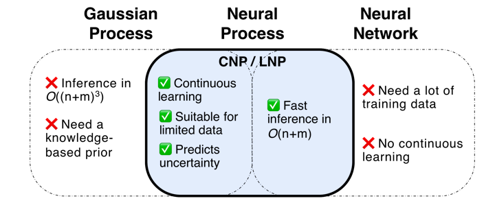
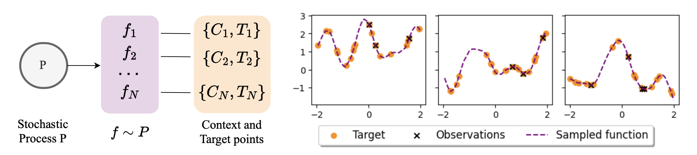
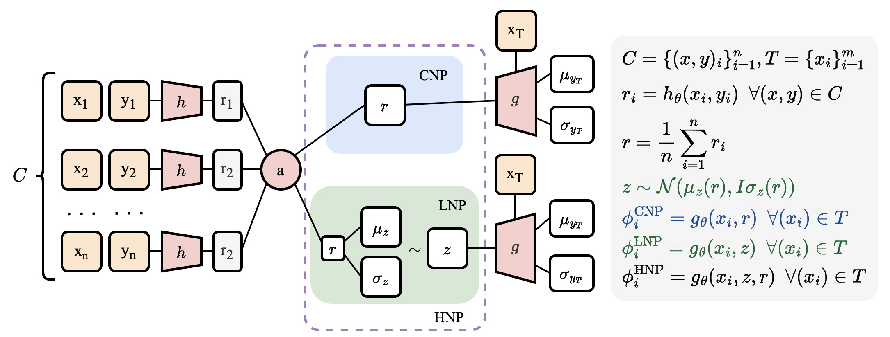
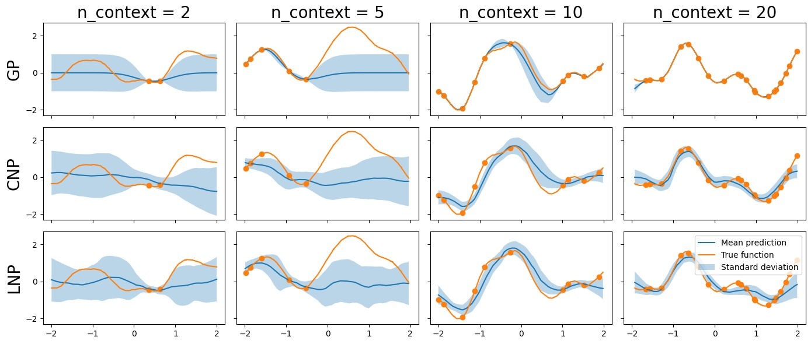
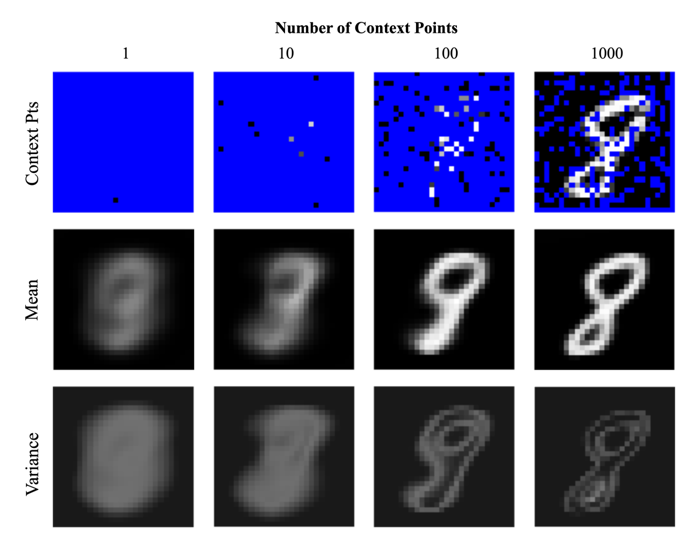
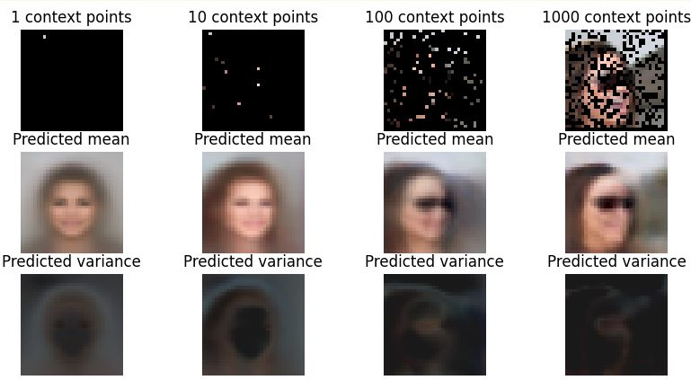

# Conditional Neural Processes
Replication of the *Conditional Neural Processes* paper by Marta Garnelo et al. Conditional Neural Processes, 2018 [[arXiv](https://arxiv.org/abs/1807.01613)]. The model and data pipeline were implemented using Tensorflow 2.10.


Project for the Advanced Machine Learning module, MPhil in MLMI, University of Cambridge.

William Baker, Alexandra Shaw, Tony Wu


## 1. Introduction

While neural networks excel at function approximation, Gaussian Processes (GPs) addresses different challenges such as continuous learning, uncertainty prediction and the ability to deal with data scarcity. Therefore, each model is only suited for a restricted spectrum of tasks that strongly depends on the nature of available data.

We will investigate Conditional Neural Processes (CNPs) and Latent Neural Processes (LNPs). These 2 types of model are part of the Neural Processes family (NPs). NPs are based on the idea of treating functions as random variables and using a neural network to encode the distribution over functions. This allows for efficient inference and scalability to large datasets. The performance on these models will be evaluated on 1D-regression and image completion to demonstrate how they learn distributions over complex functions.




<p align = "center"> <b>Figure 1: Comparison between Gaussian Process, Neural Network and Neural Process</b></p>


## 2. Instructions

1. Using an environment with `python 3.10.8`, install modules using:

   ```
   pip install -r requirements.txt
   ```

2. To create, train, and evaluate instances of neural processes, run the `train.py` script. Use `python train.py --help` to display its arguments. In particular, specify the `--model` flag with `CNP`, `HNP`, `LNP`, or `HNPC` to choose the used model. Example:

   ```bash
   python train.py --task regression --model cnp --epochs 50 --batch 128
   ```

3. The model will be saved in the `checkpoints` directory.


## 2. Data pipeline



<p align = "center"> <b>Figure 2: Data pipeline and examples of generated data for Neural Processes</b></p>

Contrarily to neural networks which predict functions, NPs predict **distributions** of functions. For this reason, we have built a specific data loader class using the `tf.data` API to produce the examples for both training and validation. Note that the class definitions for data generators can be found in the `dataloader` module directory.


## 3. Models



<p align = "center"> <b>Figure 3: Architecture diagram of CNP, LNP, and HNP</b></p>

CNP, LNP and HNP all have a similar encoder-decoder architecture. They have been implemented using classes that inherit from `tf.keras.Model`. Thus, training with the `tf.data` API is straightforward and optimized.


## 4. Experiments

### 4.1. Regression training

```bash
python train.py --task regression
```

**Example of obtained result:**



<p align = "center"> <b>Figure 4: Comparison between GP, CNP and LNP on the 1D-regression task (fixed kernel parameter)</b></p>


### 4.2. MNIST training

```bash
python train.py --task mnist
```

**Example of obtained result:**



<p align = "center"> <b>Figure 5: : CNP pixel mean and variance predictions on images from MNIST</b></p>


### 4.3. CelebA training

**Instructions:** Download the aligned and cropped images from [here](https://mmlab.ie.cuhk.edu.hk/projects/CelebA.html) and extract files in the  `./data` directory.

```bash
python train.py --task celeb
```

**Example of obtained result:**



<p align = "center"> <b>Figure 6: : CNP pixel mean and variance predictions on images from CelebA</b></p>


## 5. Appendix

To go further, read the poster and the report that can be found in the `report` folder of this repository.